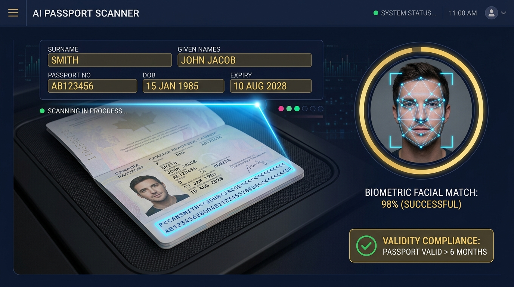
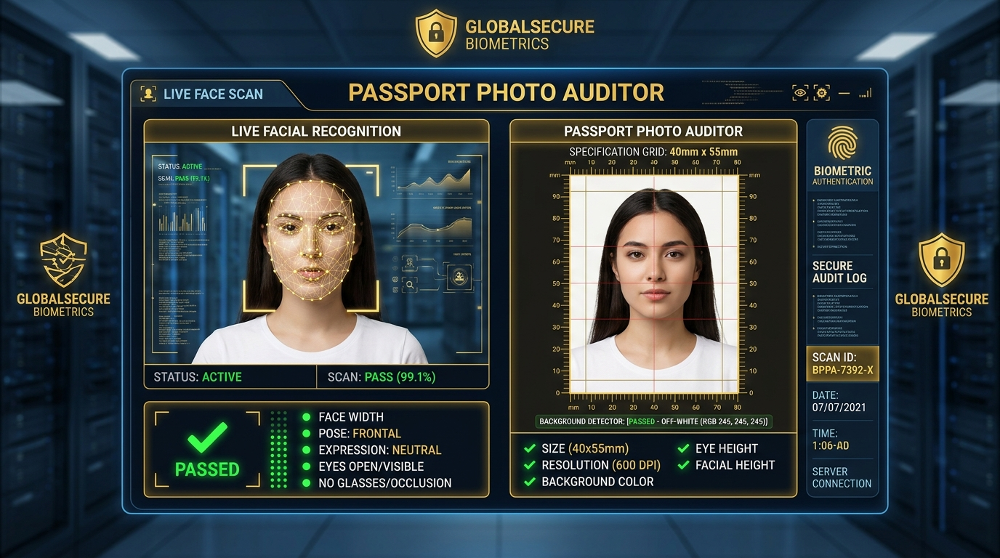
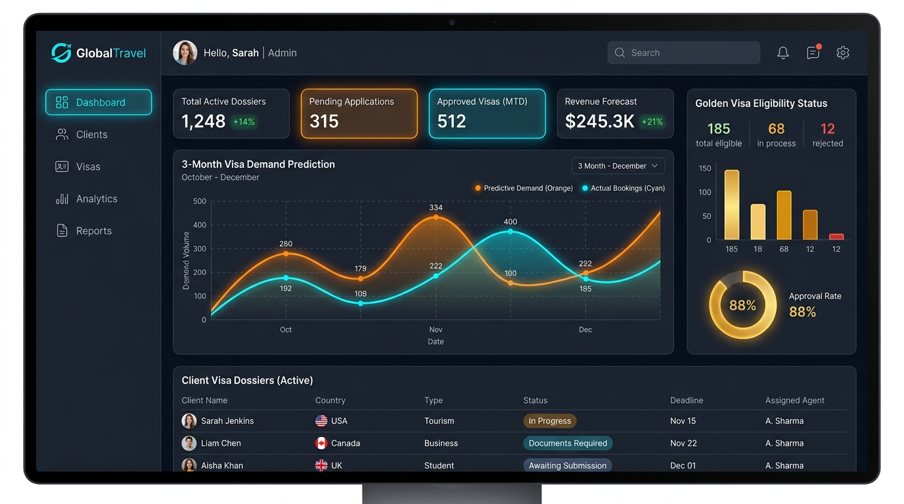

# 🇦🇪 UAE & Dubai Visa AI Hub
### আল্টিমেট এআই-চালিত সংযুক্ত আরব আমিরাত ও দুবাই ভিসা প্রসেসিং এবং ডকুমেন্ট ভেরিফিকেশন প্ল্যাটফর্ম

<div align="center">
  
</div>

<div align="center">

[](https://react.dev)
[](https://www.typescriptlang.org/)
[](https://tailwindcss.com/)
[](https://ai.google.dev/)
[](https://expressjs.com/)
[](https://web.dev/progressive-web-apps/)

</div>

---

## 📌 ওভারভিউ (Overview)

**UAE & Dubai Visa AI Hub** হলো ট্রাভেল এজেন্সি, ভিসা কনসালট্যান্ট, এবং আবেদনকারীদের জন্য তৈরি একটি পূর্ণাঙ্গ স্মার্ট প্ল্যাটফর্ম। এটি গুগল জেমিনাই (Gemini 3.7 Flash) ভিশন এআই ব্যবহার করে সংযুক্ত আরব আমিরাত (GDRFA Dubai ও ICP Abu Dhabi/Federal) এর কঠোর অভিবাসন নিয়মাবলীর সাথে পাসপোর্টের নির্ভুল OCR রিডিং, ভিসা ছবির ব্যাকগ্রাউন্ড অডিট, রিয়েল-টাইম সেলফি লাইভনেস টেস্ট, গোল্ডেন ভিসা ক্যালকুলেটর, ফি হিসাব এবং ভিসা আবেদন ট্র্যাকিং পরিচালনা করে।

---

## 🚀 প্রধান বৈশিষ্ট্যসমূহ ও মকআপ গ্যালারি (Features & Visual Previews)

### ১. 🔍 পাসপোর্ট অডিট ও অটোমেটেড OCR স্ক্যানার (`PassportAuditScanner`)
- **ICAO Doc 9303 কমপ্লায়েন্স:** পাসপোর্টের MRZ (Machine Readable Zone) স্বয়ংক্রিয়ভাবে রিড ও পার্স করে।
- **আইসিএ/জিডিআরএফএ নিয়ম পরীক্ষা:** পাসপোর্টের সর্বনিম্ন ৬ মাসের মেয়াদ, পাতা পরিষ্কার থাকা, এবং নাম-স্পেলিং ত্রুটি যাচাই।
- **পিডিএফ/ছবি এক্সপোর্ট:** তাৎক্ষণিক অডিট রিপোর্ট ও আবেদনকারীর ডাটা এক্সপোর্ট সুবিধা।

<div align="center">
  
  <p><em>চিত্র ১: আইকাও কমপ্লায়েন্ট এআই পাসপোর্ট ওসিআর স্ক্যানার ও ৬ মাসের ভ্যালিডিটি অডিট ভিউ</em></p>
</div>

---

### ২. 📸 বায়োমেট্রিক ফটো অডিটর ও লাইভনেস টেস্ট (`PhotoSpecificationAuditor` & `LivenessVerificationSection`)
- **৪০×৫৫ মিমি ও ৮০% ফেস রেশিও ডিটেকশন:** ইউএই ভিসা পোর্টালের উপযোগী ছবির ফ্রেম চেক।
- **বিশুদ্ধ সাদা ব্যাকগ্রাউন্ড ভেরিফিকেশন:** ব্যাকগ্রাউন্ড কালার, শ্যাডো ও লাইটিং রিফ্লেকশন চেক করে রিজেকশন রেট শূন্যে নামিয়ে আনে।
- **ওয়েবক্যাম লাইভ সেলফি ক্যাপচার:** রিয়েল-টাইম ফেস ট্র্যাকিং HUD ও ৩-সেকেন্ড কাউন্টডাউন টাইমার।
- **অ্যান্টি-স্পুফিং প্রোটেকশন:** স্ক্রিন বা কাগজের ছবি নকল প্রতিরোধে ৩D লাইটিং ও স্কিন ডেপথ অ্যানালাইসিস।

<div align="center">
  
  <p><em>চিত্র ২: অফিসিয়াল ইউএই ফটো স্পেসিফিকেশন অডিট ও ৩D অ্যান্টি-স্পুফিং ফেসিয়াল ম্যাচিং ইন্টারফেস</em></p>
</div>

---

### ৩. 📊 এজেন্সি CRM ও ৩-মাসের পিক ভিসা ডিমান্ড প্রেডিকশন (`AgencyCrmDashboard`)
- **৩-মাসের সিজনাল ডিমান্ড ফোরকাস্ট (Recharts):** জিসিসি উইন্টার ট্যুরিজম, গালফুড, ও জিটেক্স গ্লোবাল ইভেন্টের উপর ভিত্তি করে পূর্বাভাস।
- **ক্লায়েন্ট ডসিয়ার ও পাইপলাইন ট্র্যাকিং:** ক্লায়েন্টদের ফাইল স্ট্যাটাস, পেমেন্ট ট্র্যাকিং এবং ডকুমেন্ট ভল্ট।
- **অটোমেটেড হোয়াটসঅ্যাপ ও ইমেইল টেমপ্লেট:** ১-ক্লিকে ক্লায়েন্টকে ভিসা আপডেট মেসেজ পাঠানোর সুবিধা।

<div align="center">
  
  <p><em>চিত্র ৩: এজেন্সি সিআরএম ও রিচার্টস ৩-মাসিক পিক ভিসা ডিমান্ড ফোরকাস্ট ড্যাশবোর্ড</em></p>
</div>

---

### ৪. 🏆 গোল্ডেন ভিসা ক্যালকুলেটর ও ট্র্যাকিং পোর্টাল
- **১০ ক্যাটাগরি বিশ্লেষণ:** রিয়েল এস্টেট ইনভেস্টর (২ মিলিয়ন এইডি), উদ্যোক্তা, ফ্রন্টলাইন হিরো, ডক্টর, সফটওয়্যার ইঞ্জিনিয়ার ও অ্যাথলেট ক্যাটাগরি।
- **GDRFA ও ICP অফিসিয়াল স্ট্যাটাস ট্র্যাকার:** অ্যাপ্লিকেশন নম্বর ও পাসপোর্ট নম্বর দিয়ে সরাসরি স্ট্যাটাস চেক।
- **লাইভ ভিসা ফি ও সার্ভিস চার্জ ক্যালকুলেটর:** AED ও BDT কারেন্সি কনভার্সন এবং এজেন্সি প্রফিট মার্জিন যোগ করার সুবিধা।

---

## 🛠️ টেকনোলজি স্ট্যাক (Technology Stack)

| লেয়ার | প্রযুক্তি | বিবরণ |
|---|---|---|
| **ফ্রন্টএন্ড** | React 18, TypeScript, Vite | হাই-পারফরম্যান্স টাইপ-সেফ ইউজার ইন্টারফেস |
| **স্টাইলিং ও অ্যানিমেশন** | Tailwind CSS, Motion (`motion/react`) | ডার্ক গোল্ড লাক্সারি থিম ও রেসপন্সিভ লেআউট |
| **ডেটা ভিজ্যুয়ালাইজেশন** | Recharts, Lucide React Icons | ইন্টারেক্টিভ সিজনাল ট্রেন্ড ও অ্যানালিটিক্স গ্রাফ |
| **এআই ও ভিশন ইঞ্জিন** | Google GenAI SDK (`@google/genai`), Gemini 3.7 Flash | নির্ভুল ওসিআর, ডকুমেন্ট ভিশন ও বায়োমেট্রিক ম্যাচ |
| **সার্ভার ও এপিআই** | Express.js (Node.js backend with Vite middleware) | সিকিউর সার্ভার-সাইড জেমিনাই প্রক্সি |
| **মোবাইল ও পিডব্লিউএ** | Web App Manifest (`manifest.json`), Apple Touch Icons | মোবাইল হোমস্ক্রিন স্ট্যান্ডঅ্যালোন অ্যাপ সাপোর্ট |

---

## 📁 প্রজেক্ট স্ট্রাকচার (Project Structure)

```text
├── public/
│   ├── assets/images/            # ড্যাশবোর্ড ও প্রিভিউ ইমেজ
│   ├── favicon.svg               # অফিশিয়াল গোল্ডেন ফ্যালকন ও শিল্ড ভেক্টর আইকন
│   ├── favicon.ico               # ব্রাউজার ফেভিকন
│   ├── icon-192.png              # অ্যান্ড্রয়েড ও মোবাইল PWA আইকন
│   ├── icon-512.png              # হাই-রেজোলিউশন স্প্ল্যাশ স্ক্রিন আইকন
│   ├── icon-maskable-512.png     # অ্যান্ড্রয়েড অ্যাডাপ্টিভ মাস্কেবল আইকন
│   ├── apple-touch-icon.png      # iOS Safari হোমস্ক্রিন আইকন
│   └── manifest.json             # PWA অ্যাপ ম্যানিফেস্ট
├── src/
│   ├── assets/images/            # অ্যাপ প্রিভিউ ব্যানার ও আর্টওয়ার্ক
│   ├── components/
│   │   ├── QuickStartModal.tsx                   # অনবোর্ডিং কুইক স্টার্ট গাইড
│   │   ├── PassportAuditScanner.tsx              # পাসপোর্ট স্ক্যানার ও OCR
│   │   ├── PhotoSpecificationAuditor.tsx         # ভিসা ছবি অডিটর
│   │   ├── LivenessVerificationSection.tsx       # লাইভ সেলফি ও বায়োমেট্রিক ম্যাচ
│   │   ├── VisaDemandForecastWidget.tsx          # ৩-মাসের ভিসা ডিমান্ড ফোরকাস্ট (Recharts)
│   │   ├── GoldenVisaEligibilityCalculator.tsx   # গোল্ডেন ভিসা ক্যালকুলেটর
│   │   ├── VisaFeeCalculatorModal.tsx            # ভিসা ফি ক্যালকুলেটর
│   │   ├── GdrfaIcpTrackingPortal.tsx            # ভিসা ট্র্যাকিং পোর্টাল
│   │   ├── AgencyCrmDashboard.tsx                # এজেন্সি সিআরএম ও লিড ট্র্যাকার
│   │   ├── TemplateManagerModal.tsx              # হোয়াটসঅ্যাপ/ইমেইল টেমপ্লেট
│   │   ├── PassportAuditAnalyticsWidget.tsx      # রিয়েল-টাইম অডিট মেট্রিক্স
│   │   └── AuthModal.tsx                         # ইউজার অথেন্টিকেশন
│   ├── lib/
│   │   └── utils.ts                              # স্যাম্পল ডাটা ও ইমেজ ইউটিলিটিজ
│   ├── types.ts                                  # গ্লোবাল টাইপস্ক্রিপ্ট ইন্টারফেস
│   ├── App.tsx                                   # মূল অ্যাপ্লিকেশন শেল
│   ├── main.tsx                                  # ক্লায়েন্ট এন্ট্রি পয়েন্ট
│   └── index.css                                 # গ্লোবাল টেইলউইন্ড সিএসএস
├── server.ts                                     # এক্সপ্রেস সার্ভার ও জেমিনাই এআই ব্যাকএন্ড
├── package.json                                  # ডিপেনডেন্সি ও স্ক্রিপ্টসমূহ
├── tsconfig.json                                 # টাইপস্ক্রিপ্ট কনফিগারেশন
└── vite.config.ts                                # ভাইট বিল্ড কনফিগারেশন
```

---

## 💻 লোকাল সেটআপ ও রান করার নিয়ম (Getting Started)

### ১. রিপোজিটরি ক্লোন করুন
```bash
git clone <repository-url>
cd uae-visa-ai-hub
```

### ২. ডিপেনডেন্সি ইনস্টল করুন
```bash
npm install
```

### ৩. এনভায়রনমেন্ট ভেরিয়েবল কনফিগার করুন
`.env` ফাইল তৈরি করুন এবং আপনার Gemini API Key যুক্ত করুন:
```env
GEMINI_API_KEY=your_gemini_api_key_here
```

### ৪. ডেভেলপমেন্ট সার্ভার চালু করুন
```bash
npm run dev
```
ব্রাউজারে চালু করুন: `http://localhost:3000`

### ৫. প্রোডাকশন বিল্ড
```bash
npm run build
npm run start
```

---

## 🔒 সিকিউরিটি ও প্রাইভেসি (Security & Privacy)
- সমস্ত Gemini API কল এক্সপ্রেস ব্যাকএন্ড (`/api/*`) এর মাধ্যমে সিকিউর প্রক্সি করা থাকে, ফলে ব্রাউজারে কোনো এপিআই কি এক্সপোজ হয় না।
- পাসপোর্টের ডেটা ও বায়োমেট্রিক ছবি সরাসরি প্রসেস করে তৎক্ষণাৎ অডিট ফলাফল তৈরি করে, থার্ড পার্টিতে সংরক্ষিত হয় না।

---

## 📄 লাইসেন্স (License)
এই প্রজেক্টটি সর্বস্বত্ব সংরক্ষিত ও ট্রাভেল এজেন্সি অটোমেশনের জন্য উন্মুক্ত।

---
**Developed with ❤️ for UAE Travel Agencies, Typing Centers & Immigration Professionals.**
